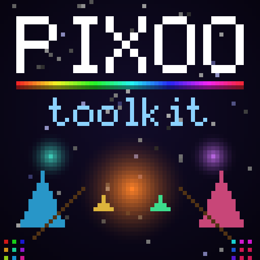

<div align="center">



# @cyanheads/pixoo-toolkit

**TypeScript toolkit for Divoom Pixoo displays**\
Pixel rendering, animations, and device control over the local HTTP API.\
Supports Pixoo-16, Pixoo-32, and Pixoo-64.

[](https://www.typescriptlang.org/) [](https://bun.sh/) [](LICENSE)

</div>

---

## Overview

Full programmatic control of Divoom Pixoo displays from TypeScript — bypassing the Divoom app entirely. Push custom visuals, animations, dashboards, and interactive displays to the RGB LED matrix over your local network. Supports all three Pixoo sizes: 16×16, 32×32, and 64×64.

### Highlights

| Module | What it does |
|---|---|
| **Canvas** | Square RGBA pixel buffer (16/32/64) — alpha-aware source-over compositing, pixel access, rects, circles, lines, triangles, 3 gradient modes, clone, scrolling; exports flatten to device RGB |
| **Bitmap Fonts** | Two built-in sizes (5×7 full ASCII, 3×5 compact with lowercase) with tight proportional metrics, measurement, and centered rendering |
| **Color System** | RGB/HSL types, 30+ named colors, interpolation, hex parsing — strict resolution (typos throw, `tryResolveColor` to probe) |
| **Device Client** | Full Pixoo HTTP API — frames, animations, channels, brightness, screen on/off, clock faces, text overlays, scoreboard, timer, stopwatch, noise meter, buzzer, batch commands, LAN discovery. Every call returns a discriminated `PixooResult` — failures can't be mistaken for success |
| **Image Loading** | Alpha-preserving resize to canvas via sharp, sprite downsampling with color classification |
| **Animation Builder** | Multi-frame sequences with per-frame render callbacks |
| **SVG Paths** | Parse SVG `d` attributes (lines + sampled Bézier curves) and rasterize with even-odd scanline fill — multi-subpath holes |
| **PNG & GIF Export** | Zero-dependency PNG encoder (using `node:zlib`), animated GIF encoder (via gifenc), nearest-neighbor upscaling |

## Getting Started

### Prerequisites

- **Bun** >= 1.3
- **Divoom Pixoo** (16, 32, or 64) on the same network

### Install

```bash
# npm
npm install @cyanheads/pixoo-toolkit

# bun
bun add @cyanheads/pixoo-toolkit
```

### Local Development

```bash
git clone https://github.com/cyanheads/pixoo-toolkit.git
cd pixoo-toolkit
bun install
bun run build
bun run test
```

> **Tip:** Set `PIXOO_IP` to your device's local IP address. Set `PIXOO_SIZE` to `16` or `32` for non-64 displays. See `.env.example`.

## Usage

### Quick Example

```typescript
import { PixooClient, Canvas, Color, drawTextCentered, FONT_5x7, savePng } from '@cyanheads/pixoo-toolkit';

// Set PIXOO_IP env var to your device's local IP (see .env.example)
const device = new PixooClient(process.env.PIXOO_IP!);
const canvas = new Canvas();

canvas.gradientV([10, 5, 30], [5, 15, 40]);
drawTextCentered(canvas, 'HELLO', 28, Color.WHITE, { font: FONT_5x7 });

await savePng(canvas, 'output/hello.png');
const res = await device.push(canvas);
if (!res.ok) console.error(`push failed — ${res.kind}: ${res.message}`);
```

### Finding Your Device

No IP handy? Discover Pixoo devices on your LAN (calls Divoom's cloud discovery endpoint, so it needs internet access):

```typescript
const [found] = await PixooClient.discover();
const device = new PixooClient(found.ip);
```

### Animation

```typescript
import { PixooClient, buildAnimation, drawTextCentered, hslToRgb, Color, FONT_5x7 } from '@cyanheads/pixoo-toolkit';

const device = new PixooClient(process.env.PIXOO_IP!);
const anim = buildAnimation(20, 120, (frame, i, total) => {
  frame.clear('black');
  const color = hslToRgb([(i / total) * 360, 0.9, 0.6]);
  frame.fillCircle(32, 32, 10 + i, color);
  drawTextCentered(frame, 'HI', 28, Color.WHITE, { font: FONT_5x7 });
});

await device.pushAnimation(anim.frames, anim.speed);
```

### Loading Images

```typescript
import { loadImage, downsampleSprite, renderSprite, Canvas, savePng } from '@cyanheads/pixoo-toolkit';

// Full-resolution resize to 64×64
const canvas = await loadImage('assets/photo.png');

// Or downsample into a pixel-art sprite grid
const sprite = await downsampleSprite('assets/clawd.png', 10, 8);
const c = new Canvas();
renderSprite(c, sprite.grid, { scale: 4, y: 24 });
await savePng(c, 'output/sprite.png');
```

## Project Structure

```
src/
  canvas.ts       Square pixel buffer (16/32/64) + drawing primitives
  client.ts       PixooClient — HTTP device control (all Pixoo sizes)
  color.ts        RGB/HSL types, named colors, utilities
  font.ts         Bitmap fonts, text rendering
  image.ts        Image loading (sharp), sprite downsampling
  animation.ts    Multi-frame animation builder
  preview.ts      PNG + animated GIF encoder
  svg-path.ts     SVG path parser + polygon rasterizer
  index.ts        Barrel export
tests/            Vitest tests (one per src module)
scripts/          Runnable display scripts
assets/           Source images (PNGs) for sprites
output/           Generated PNG previews (gitignored)
```

## Device API

All commands go to `POST http://<device-ip>/post` with a JSON body containing a `Command` field. The `PixooClient` class wraps this — use `client.send(command, params)` for raw access, or the typed convenience methods.

Every call returns a `PixooResult`: `{ ok: true, data }` or `{ ok: false, kind, message }` where `kind` is `'network' | 'timeout' | 'http' | 'device'` — narrow on `ok` to reach the data, or use `unwrap()` to throw on failure.

```typescript
import { PixooClient, Channel, unwrap } from '@cyanheads/pixoo-toolkit';

const device = new PixooClient(process.env.PIXOO_IP!);

// Raw command
const res = await device.send('Channel/SetBrightness', { Brightness: 80 });
if (!res.ok) throw new Error(res.message);

// Typed convenience
await device.setBrightness(80);
await device.setChannel(Channel.Custom);

// unwrap() for scripts that prefer exceptions
const { SelectIndex } = unwrap(await device.getChannel());
```

## License

[Apache 2.0](LICENSE)
