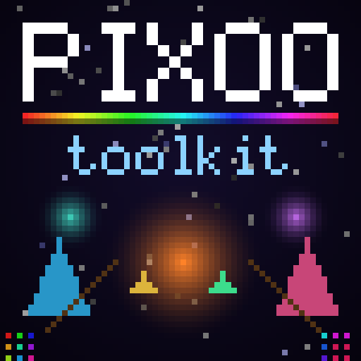

<div align="center">



# @cyanheads/pixoo-toolkit

**TypeScript toolkit for Divoom Pixoo displays**\
Pixel rendering, animations, and device control over the local HTTP API.\
Supports Pixoo-16, Pixoo-32, and Pixoo-64.

[](https://www.typescriptlang.org/) [](https://bun.sh/) [](LICENSE)

</div>

---

> **Building for AI agents?** [`@cyanheads/pixoo-mcp-server`](https://github.com/cyanheads/pixoo-mcp-server) is built on this toolkit — it exposes Pixoo rendering, scene composition, and device control as Model Context Protocol tools.

## Overview

Full programmatic control of Divoom Pixoo displays from TypeScript — bypassing the Divoom app entirely. Push custom visuals, animations, dashboards, and interactive displays to the RGB LED matrix over your local network. Supports all three Pixoo sizes: 16×16, 32×32, and 64×64.

### Highlights

| Module | What it does |
|---|---|
| **Canvas** | RGBA pixel buffer at a panel size (16/32/64) or any width × height up to 4096 for layers and strips — alpha-aware compositing with `normal`, `add`, `screen`, and `multiply` blend modes, pixel access, rects, circles, lines, triangles, translucent fills and strokes, stroke widths, anti-aliased lines and circles, 3 gradient modes, clone, scrolling; exports flatten to device RGB |
| **Bitmap Fonts** | Two built-in text sizes (5×7 and 3×5 compact with lowercase), each covering printable ASCII plus `° ← ↑ → ↓ ▲ ▼ ♥ · …`, with tight proportional metrics; 11×18 numerals on one advance for clocks and readouts; BDF font loading with per-glyph offsets and advances; measurement and centered rendering |
| **Color System** | RGB/HSL types, 30+ named colors, interpolation, hex parsing — strict resolution (typos throw, `tryResolveColor` to probe) |
| **Device Client** | Full Pixoo HTTP API — frames, animations, GIF playback from a URL, channels, brightness, screen on/off, clock faces, text overlays, scoreboard, timer, stopwatch, noise meter, buzzer, batch commands, LAN discovery. Every call returns a discriminated `PixooResult` — failures can't be mistaken for success. Pushed canvases must match the configured display size, and `minPushInterval` spaces frames to respect the firmware's push limit |
| **Image Loading** | Alpha-preserving resize to canvas via sharp from a file path or in-memory bytes, always from the full-resolution decode, so the default nearest-neighbor kernel keeps pixel art crisp in every format; animated GIF and WebP decoded to frames with their delays; sprite downsampling with color classification |
| **LED Finishing** | Exact area downsampling in linear light that never rings on hard edges; palette reduction by variance split or to your own colors, with Bayer 4×4 or Floyd–Steinberg dithering; correction for a panel's measured drive-to-light response, and a preview of what the panel shows. Runs in the browser through `/core` |
| **Animation Builder** | Multi-frame sequences with per-frame render callbacks |
| **SVG Paths** | Parse SVG `d` attributes (lines + sampled Bézier curves and elliptical arcs) and rasterize with even-odd scanline fill — multi-subpath holes — or as 1-pixel strokes, for the `fill="none"` outline icons most icon sets ship |
| **PNG & GIF Export** | Zero-dependency PNG encoder (using `node:zlib`), animated GIF encoder (via gifenc), nearest-neighbor upscaling at any positive integer scale (by default 8, lowered so a large canvas stays within 4096 px per side). PNG defaults to alpha flattened over black — what the panel shows — with `{ alpha: true }` to keep the alpha channel instead |

## Getting Started

### Prerequisites

- **Bun** >= 1.3 or **Node.js** >= 20.9
- **Divoom Pixoo** (16, 32, or 64) on the same network

### Install

```bash
# npm
npm install @cyanheads/pixoo-toolkit

# bun
bun add @cyanheads/pixoo-toolkit
```

### Local Development

```bash
git clone https://github.com/cyanheads/pixoo-toolkit.git
cd pixoo-toolkit
bun install
bun run devcheck
bun run test:all
```

The test suite runs on Vitest 5, which needs Node.js >= 22.12.

> **Tip:** Set `PIXOO_IP` to your device's local IP address. Set `PIXOO_SIZE` to `16` or `32` for non-64 displays. See `.env.example`.

## Usage

### Quick Example

```typescript
import { PixooClient, Canvas, Color, drawTextCentered, FONT_5x7, savePng } from '@cyanheads/pixoo-toolkit';

// Set PIXOO_IP env var to your device's local IP (see .env.example)
const device = new PixooClient(process.env.PIXOO_IP!);
const canvas = new Canvas();

canvas.gradientV([10, 5, 30], [5, 15, 40]);
drawTextCentered(canvas, 'HELLO', 28, Color.WHITE, { font: FONT_5x7 });

await savePng(canvas, 'output/hello.png');
const res = await device.push(canvas);
if (!res.ok) console.error(`push failed — ${res.kind}: ${res.message}`);
```

### Finding Your Device

No IP handy? Discover Pixoo devices on your LAN (calls Divoom's cloud discovery endpoint, so it needs internet access):

```typescript
const [found] = await PixooClient.discover();
const device = new PixooClient(found.ip);
```

### Animation

```typescript
import { PixooClient, buildAnimation, drawTextCentered, hslToRgb, Color, FONT_5x7 } from '@cyanheads/pixoo-toolkit';

const device = new PixooClient(process.env.PIXOO_IP!);
const anim = buildAnimation(20, 120, (frame, i, total) => {
  frame.clear('black');
  const color = hslToRgb([(i / total) * 360, 0.9, 0.6]);
  frame.fillCircle(32, 32, 10 + i, color);
  drawTextCentered(frame, 'HI', 28, Color.WHITE, { font: FONT_5x7 });
});

await device.pushAnimation(anim.frames, anim.speed);
```

Animation frames passed to `pushAnimation()`, `encodeAnimationGif()`, or `saveAnimationGif()` must all have the same dimensions.

### Colors

String colors accept case-insensitive named colors or an optional single `#` followed by exactly 3 or 6 ASCII hexadecimal digits. `resolveColor()` throws for every other string; use `tryResolveColor()` when an invalid string should return `null` instead.

### Fonts

`FONT_5x7` (the default) and `FONT_3x5` cover printable ASCII plus `° ← ↑ → ↓ ▲ ▼ ♥ · …`. `FONT_DIGITS_11x18` sets large numerals on one 13-pixel advance, so a centered clock stays put as the time changes; it holds `0–9`, space, and `: . - + / % ° ?`:

```typescript
import { Canvas, drawText, drawTextCentered, FONT_DIGITS_11x18 } from '@cyanheads/pixoo-toolkit';

const canvas = new Canvas();
drawText(canvas, '72°F ▲', 2, 2, 'white');
drawTextCentered(canvas, '12:45', 40, 'cyan', { font: FONT_DIGITS_11x18 });
```

`scale` takes any finite number of at least 1, and `letterSpacing` any finite number, negative included. `drawText()`, `measureText()`, and `drawTextCentered()` throw `RangeError` naming the function and the option for anything else, and for a non-finite position, as the canvas primitives do.

`parseBdf()` loads a font in BDF, the bitmap format most pixel fonts ship in. It takes the file's text rather than a path, so it works from `/core` too:

```typescript
import { readFile } from 'node:fs/promises';
import { parseBdf } from '@cyanheads/pixoo-toolkit';

const font = parseBdf(await readFile('fonts/spleen-8x16.bdf', 'utf8'));
drawText(canvas, 'Hello', 0, 20, 'white', { font });
```

Each glyph is keyed by its code point and drawn at the offset and advance its `BBX` and `DWIDTH` give, on the font's baseline. `letterSpacing` defaults to 0 for these fonts and `FONT_DIGITS_11x18`, since their advances already include the gap. Malformed BDF throws `SyntaxError` naming the line; a glyph wider than 32 pixels or a charset other than ISO10646 or ISO8859-1 throws `RangeError`. A character the font lacks draws its `?`.

### Loading Images

```typescript
import { loadImage, downsampleSprite, renderSprite, Canvas, savePng } from '@cyanheads/pixoo-toolkit';

// Full-resolution resize to 64×64
const canvas = await loadImage('assets/photo.png');

// Or downsample into a pixel-art sprite grid
const sprite = await downsampleSprite('assets/clawd.png', 10, 8);
const c = new Canvas();
renderSprite(c, sprite.grid, { scale: 4, y: 24 });
await savePng(c, 'output/sprite.png');
```

Both also take encoded bytes — a `Buffer` or any `Uint8Array` — so an image you already hold needs no temp file:

```typescript
const bytes = new Uint8Array(await (await fetch(url)).arrayBuffer());
const fetched = await loadImage(bytes, { fit: 'cover' });
```

`loadAnimation` decodes every frame of an animated GIF or WebP, each on its own canvas. The device takes one speed per animation and turns unstable above ~40 frames, so cap with `maxFrames` — it samples a longer source evenly and sums the delays each kept frame stands in for:

```typescript
import { loadAnimation } from '@cyanheads/pixoo-toolkit';

const anim = await loadAnimation('assets/loop.gif', { size: 64, fit: 'contain', maxFrames: 40 });
const speed = Math.round(anim.delays.reduce((sum, d) => sum + d, 0) / anim.frames.length);
await device.pushAnimation(anim.frames, speed);
```

### Canvases of Any Size

`new Canvas(width, height)` (or `new Canvas(size)` for a square) takes any dimensions from 1 to 4096, and `Canvas.fromRgba(bytes, width, height)` copies RGBA data of any size. Only a canvas the size of the panel can be pushed; other sizes are layers you `blit` from — here, text rendered once to a wide strip and scrolled across the panel:

```typescript
import { Canvas, drawText, measureText } from '@cyanheads/pixoo-toolkit';

const message = 'Rendered once, scrolled by offset';
const strip = new Canvas(measureText(message) + 64, 7);
drawText(strip, message, 64, 0, 'white');

const frames = Array.from({ length: 40 }, (_, i) =>
  new Canvas().clear('black').blit(strip, -i * 4, 28),
);
await device.pushAnimation(frames, 80);
```

### Finishing for the LEDs

Render large, then finish the frame for the panel: `downsample` shrinks it, `quantize` reduces it to a palette, and `correctForPanel` maps it through your panel's measured response. Each returns a new canvas and leaves its input alone.

```typescript
import { Canvas, downsample, quantize, correctForPanel, simulatePanel } from '@cyanheads/pixoo-toolkit';

const hiRes = new Canvas(512, 512); // draw at 8× the panel
const frame = downsample(hiRes, 64, 64);
const poster = quantize(frame, { colors: 16, dither: 'bayer4' });
const brand = quantize(frame, { palette: ['#000000', '#f0ead6', 'claude'], dither: 'floyd-steinberg' });

// [drive, light] points measured on your panel, from [0, 0] to [255, 1]
const response = [[0, 0], [4, 0], /* …your measurements… */ [255, 1]] as const;
await device.push(correctForPanel(poster, response));
const preview = simulatePanel(poster, response); // what the panel shows if `poster` is pushed as is
```

- `downsample` averages each output pixel's exact footprint in linear light, partial pixels included at a non-integer ratio, so no channel leaves the range of the source pixels it covers. Color is weighted by alpha, and a fully transparent footprint stays `[0, 0, 0, 0]`.
- `quantize` takes exactly one of `colors` (2–256: a palette built from the frame by variance split; a frame already within the limit comes back unchanged) and `palette` (your colors). `dither` is `'none'` (nearest color), `'bayer4'` (a 4×4 ordered mix of the two nearest colors), or `'floyd-steinberg'` (error diffusion in linear light). Alpha passes through.
- `correctForPanel` gives each channel the drive whose light is nearest the sRGB value's light, and `simulatePanel` shows what a frame looks like pushed as is. Both flatten alpha over black and return an opaque canvas. No response ships with the toolkit — measure your own panel. A Pixoo-64 at brightness 100 stays dark through drive 4, so its response starts `[[0, 0], [4, 0], …]`, and correction can't create dark levels the panel lacks.

### Blending, Alpha, and Strokes

`blit` combines layers by `mode`: `normal` (source-over, the default), `add` (light sums, clamped — glow and trails), `screen`, or `multiply`. The fills and strokes take an `alpha` option, and the strokes a `width` in whole pixels; `drawLine` and `drawCircle` also take `antialias`:

```typescript
import { Canvas } from '@cyanheads/pixoo-toolkit';

const glow = new Canvas().fillCircle(28, 32, 14, [255, 110, 20], { alpha: 0.5 });
const canvas = new Canvas().clear('black');
canvas.blit(glow, 0, 0, { mode: 'add' }).blit(glow, 8, 0, { mode: 'add' }); // the overlap brightens
canvas.drawRect(4, 4, 56, 56, 'white', { width: 2, alpha: 0.8 }); // width grows inward
canvas.drawLine(0, 0, 63, 40, 'cyan', { width: 3, antialias: true });
canvas.drawCircle(32, 32, 20, 'gold', { width: 2, antialias: true, alpha: 0.6 });
```

`alpha` is 0–1 opacity on `blendPixel`'s scale, not `setPixel`'s 0–255 byte, and each pixel is composited once. `drawRect` grows its width inward, inside the region `fillRect` fills; `drawLine` and `drawCircle` center it on the path. Anti-aliasing shades each edge pixel by how much of it the stroke covers, from the exact coordinates; without it, a line floors its endpoints as the 1px line does, and a circle keeps its exact center. The 1px `drawCircle` ring lies on the `fillCircle` disc of the same center and radius. Omitting the options draws exactly what the 1px, opaque calls always have.

### SVG Paths

Pass the `d` attribute and the source `viewBox`; the path is scaled into the target rect.

```typescript
import { Canvas, renderSvgPath } from '@cyanheads/pixoo-toolkit';

const canvas = new Canvas();

// Filled path — even-odd, so nested subpaths cut holes
renderSvgPath(canvas, filledIcon, 'cyan', [24, 24], [8, 8, 24, 24]);

// Outline path — 1px stroke along the segments
renderSvgPath(canvas, outlineIcon, 'cyan', [24, 24], [32, 8, 24, 24], { mode: 'stroke' });
```

Fill is the default. Reach for `{ mode: 'stroke' }` when the source path is `fill="none" stroke="..."` — the outline style Lucide, Feather, and Heroicons outline ship — since filling one of those paints the region the outline encloses rather than the outline itself. Stroke is 1 pixel wide; `stroke-width`, joins, caps, and dashes are not interpreted.

### Browsers and Bundlers

The main entry loads sharp, `node:zlib`, and `node:fs/promises`, so it needs Node or Bun. `@cyanheads/pixoo-toolkit/core` exports the canvas, color, font, SVG path, animation, and LED finishing modules, none of which reach a Node built-in or a package, so a bundler can target the browser with them:

```typescript
import { Canvas, drawText, FONT_5x7 } from '@cyanheads/pixoo-toolkit/core';

const canvas = new Canvas(64);
drawText(canvas, 'HI', 1, 1, 'cyan', { font: FONT_5x7 });
const picData = canvas.toBase64(); // Draw/SendHttpGif payload, no Buffer needed
```

Both entries share one `Canvas` class, so a canvas drawn through `/core` pushes with `PixooClient` from the main entry. The device client, image loading, and PNG/GIF export stay on the main entry. TypeScript resolves the `/core` subpath under `moduleResolution` `node16`, `nodenext`, or `bundler`.

## Project Structure

```
src/
  canvas.ts       RGBA pixel buffer (panel sizes or any size up to 4096) + drawing primitives, blend modes, alpha, stroke width, anti-aliasing
  client.ts       PixooClient — HTTP device control (all Pixoo sizes)
  color.ts        RGB/HSL types, named colors, utilities
  font.ts         Bitmap fonts (5×7, 3×5, 11×18 numerals), BDF loading, text rendering
  image.ts        Image + animated GIF/WebP loading (sharp), sprite downsampling
  animation.ts    Multi-frame animation builder
  preview.ts      PNG + animated GIF encoder
  svg-path.ts     SVG path parser + polygon rasterizer (fill and stroke)
  finish.ts       LED finishing: area downsampling, palette quantization + dithering, panel response correction
  core.ts         Browser-safe entry (/core): canvas, color, font, SVG, animation, finishing
  index.ts        Barrel export — core plus the device client, image, and preview
tests/            Vitest tests — one per module, plus packaging.test.ts (entries, browser bundle, packed files); type-checked via tests/tsconfig.json
scripts/          Runnable display scripts
assets/           Source images (PNGs) for sprites
output/           Generated PNG previews (gitignored)
```

## Device API

All commands go to `POST http://<device-ip>/post` with a JSON body containing a `Command` field. The `PixooClient` class wraps this — use `client.send(command, params)` for raw access, or the typed convenience methods.

For raw calls, the positional `command` is authoritative if `params` also contains a top-level `Command`; other parameters, including nested `CommandList` entries, are preserved. The client retries network failures, abort-driven timeouts, and HTTP 408, 429, 500, 502, 503, and 504 with exponential backoff. Other HTTP failures and device rejections return immediately; `retries: 0` makes one attempt.

Every call returns a `PixooResult`: `{ ok: true, data }` or `{ ok: false, kind, message }` where `kind` is `'network' | 'timeout' | 'http' | 'device'` — narrow on `ok` to reach the data, or use `unwrap()` to throw on failure.

`size` tells the client which panel it is talking to. `push()` and `pushAnimation()` throw `RangeError` for a canvas that doesn't match it, before any request goes out — the device would render a mismatched frame garbled or not at all, and that failure is invisible from the calling side. A `PixooResult` is reserved for what the device and network do; a canvas sized wrong at construction is a coding error.

A `NaN` or infinite number passed to `setTimer()`, `setScoreboard()`, `setClock()`, `playBuzzer()`, `sendText()`, `setChannel()`, `clearText()`, or the `speed` of `push()` and `pushAnimation()` throws `RangeError` naming the method and parameter, also before any request — JSON would send it to the device as `null`. For `push()` and `pushAnimation()` that includes the `Draw/ResetHttpGifId` request ahead of the frames. `setBrightness()` clamps `±Infinity` to 0–100 and throws only for `NaN`.

The firmware can freeze after roughly 300 consecutive pushes, so pushes should be spaced about a second apart. `minPushInterval` enforces that spacing across `push()` and `pushAnimation()` — including between the frames of one animation, which is where the pushes accumulate fastest:

```typescript
const device = new PixooClient(process.env.PIXOO_IP!, { size: 64, minPushInterval: 1000 });
```

It is off by default. The interval covers the `Draw/SendHttpGif` frames only, measured from when each send starts; the `Draw/ResetHttpGifId` that precedes a push and every non-drawing command go out unthrottled.

```typescript
import { PixooClient, Channel, unwrap } from '@cyanheads/pixoo-toolkit';

const device = new PixooClient(process.env.PIXOO_IP!);

// Raw command
const res = await device.send('Channel/SetBrightness', { Brightness: 80 });
if (!res.ok) throw new Error(res.message);

// Typed convenience
await device.setBrightness(80);
await device.setChannel(Channel.Custom);

// unwrap() for scripts that prefer exceptions
const { SelectIndex } = unwrap(await device.getChannel());
```

`playGifUrl()` hands the device a GIF URL instead of frames. The Pixoo downloads the file itself and loops it, so there is no request per frame and no ~40-frame ceiling — a Pixoo-64 has played 800-frame, 4 MB GIFs this way. You host the file, over `http` or `https`:

```typescript
const res = await device.playGifUrl('http://192.0.2.10:8765/loop.gif');
if (!res.ok) console.error(`${res.kind}: ${res.message}`);
```

`ok: true` means the device accepted the command, not that the GIF played: it replies before downloading, and reports success for a 404, an unreachable host, or a file that isn't a GIF. Serve a 16×16, 32×32, or 64×64 GIF — any other size reboots the device once it downloads. A URL over 255 bytes (UTF-8) throws `RangeError` without sending a request — the device gives no reply to one and reboots. `minPushInterval` doesn't apply; a play is one command.

## License

[Apache 2.0](LICENSE)
